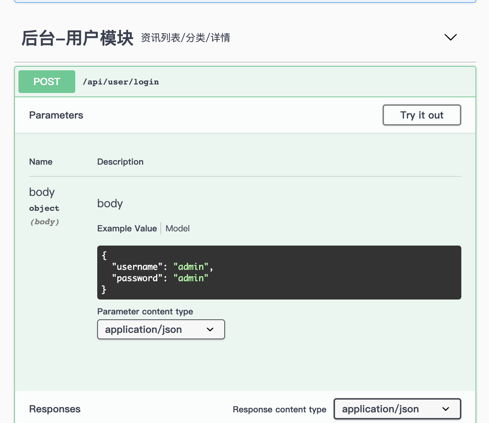
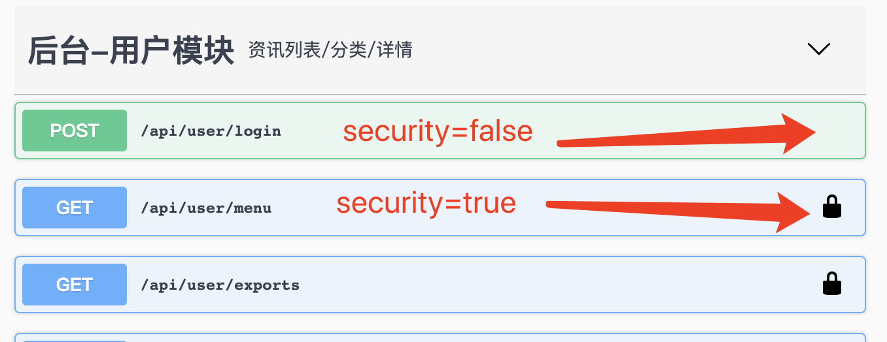
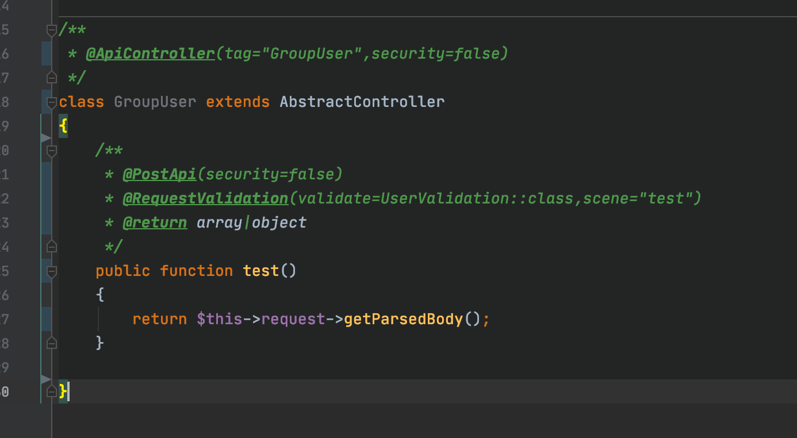
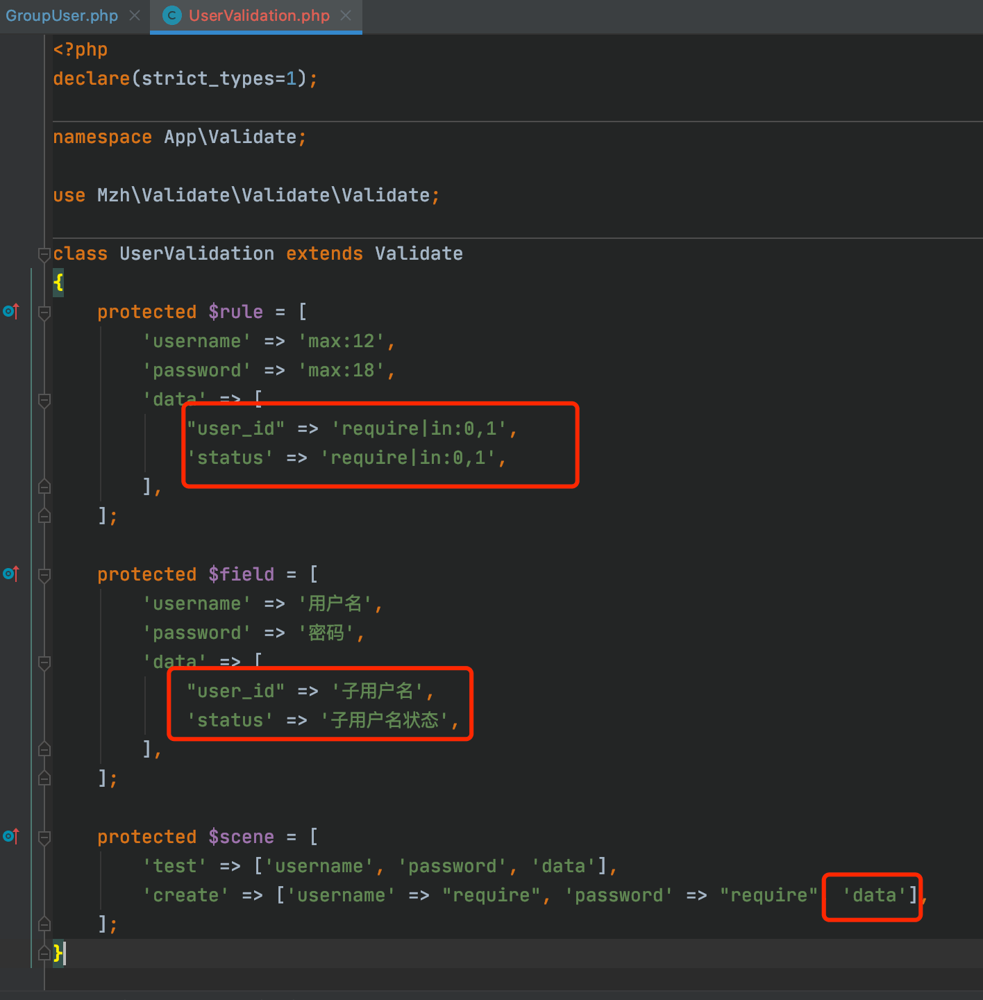
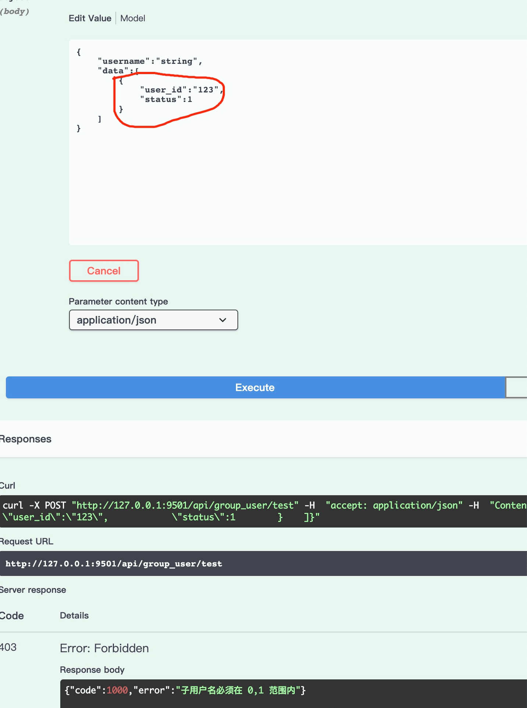

# hyperf-validate
支持request 和方法场景验证，兼容tp写法
性能比laravel验证器提高50% 

<p align="center">
    <a href="https://github.com/lphkxd/hyperf-validate/releases"></a>
    <a href="https://travis-ci.org/mzh/hyperf-validate"></a>
    <a href="https://packagist.org/packages/mzh/hyperf-validate"></a>
    <a href="https://packagist.org/packages/mzh/hyperf-validate"></a>
    <a href="https://www.php.net"></a>
    <a href="https://github.com/swoole/swoole-src"></a>
    <a href="https://github.com/lphkxd/hyperf-validate/blob/master/LICENSE"></a>
</p>

## 安装方法

     安装方法  composer require mzh/hyperf-validate
     
## 具体使用方法可以参考项目 https://github.com/lphkxd/hyperf-admin

## 注解
     @Validation
     @RequestValidation

### @RequestValidation 参数说明
```
方式一：
validate = 验证类 例如   validate=AdminValidation::class
方式2：
mode="Admin" 验证的模块规则/app/Validate/AdminValidation.php 文件的验证规则
方式3：
不填写以上2个参数，默认取验证器为当前控制器类文件名的验证器文件
          （如果使用了mzh/hyperf-swagger 根据验证器规则生成文档 见下图1）

scene="场景" 场景，验证哪个场景。默认不写为默认的验证规则
filter=true 过滤掉规则外无用参数 过滤后会重新写入$this->request->getParsedBody()内，
              需要时直接取，数据是安全的，验证过的
security=true 严格验证模式，如果开启，则用户传入无用参数，直接抛出异常，提示传入的字段xx无效，
              （如果使用了mzh/hyperf-swagger 会在生成的接口上标记接口需token验证的小锁 见下图2，如果使用了hyperf-admin，则设为false此方法为开放资源，不验证此任何权限）
userOpen = true  (可选)，此参数是配合 mzh/hyperf-admin权限验证，设为true为只要登录该路由的url就可以访问，否则需要授权才可以访问
```
 - 图1 


 - 图2



### @Validation 参数说明
```
方式一：
validate = 验证类 例如   validate=AdminValidation::class
方式2：
mode="Admin" 验证的模块规则/app/Validate/AdminValidation.php 文件的验证规则
方式3：
不填写以上2个参数，默认取验证器为当前类文件名的验证器文件

scene="场景" 场景，验证哪个场景。默认不写为默认的验证规则
filter=true 过滤掉规则外无用参数 过滤后会重新写入对应的字段内，需要时直接取，数据是安全的，验证过的
security=true 严格验证模式，如果开启，则用户传入无用参数，直接抛出异常，提示传入的字段xx无效，
field="data" 方法的参数名，例如 function($data,$array,$array3) 需要验证这个方法的$array参数，这里填array
```  
    
## 验证控制器数据方法如下


### 例如 验证控制器Admin 的login方法传的数据，需要如下操作
```
use Mzh\Validate\Annotations\RequestValidation;

/**
 * @RequestValidation(filter=true,throw=true)
 */
public function login(){
      //这里取到的 $data 是安全的。
     $data = $this->request->getParsedBody();
}
```

## 验证类方法数据方法如下
例如 验证AdminService类的login方法传的数据，需要如下操作
```
use Mzh\Validate\Annotations\Validation;

/**
 * @Validation(mode="Admin",scene="login",field="data")
 * @Validation(mode="Admin",scene="array的规则",field="array")
 */
public function login($data,$array,$array2){
      //这里取到的 $data,$array,$array2 是安全的，经过验证器验证过的

}
```
## 多维数组验证
```

 protected $rule = [
        'username' => 'max:12',
        'password' => 'max:18',
        'data' => [ #划重点  数组形式将需要验证的字段和规则写入  看图3、4、5
            "user_id" => 'require|in:0,1',
            'status' => 'require|in:0,1',
        ],
    ];

```
 - 图3 使用注解方式


 - 图4 写验证器规则和场景


 - 图5 测试结果


